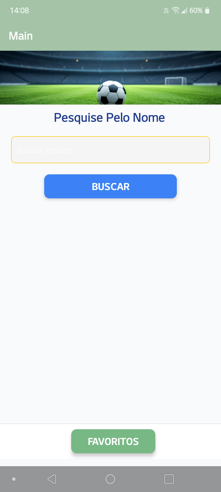
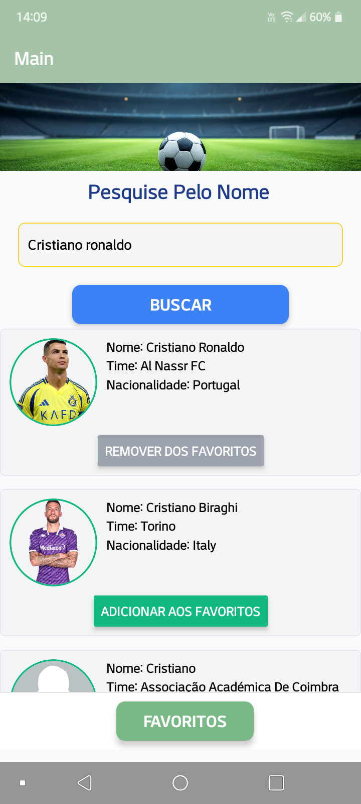
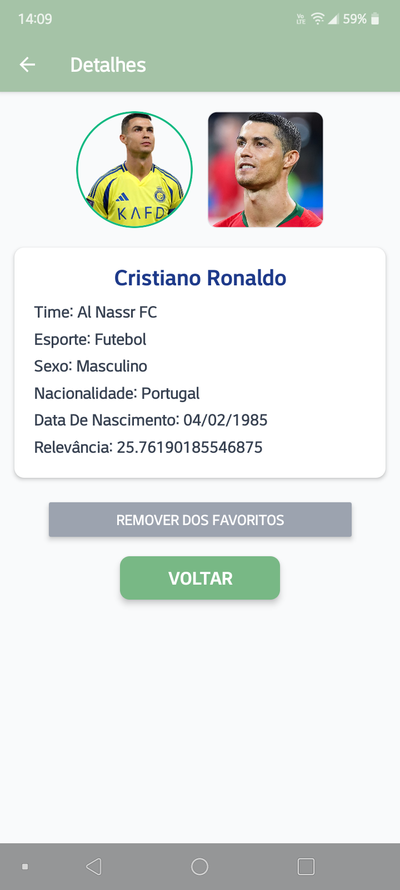
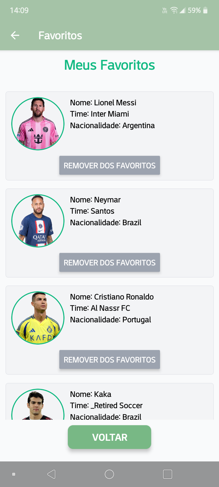

# Versão APP 

Nesta versão para Android e IOS, foram feitas melhorias em relação a versão para WEB.

## Imagens

 
 

 
 

 
 

## Download das depêndencias e iniciar o eas

<code>npm i</code>
 
<code>eas init</code>

## Como rodar o projeto

Executando com o expo, é possivel visualizar pela web, no próprio dispositivo com o app do expo(qrCode) e no emulador

<code>npx expo start</code>

## Construir o APK independente para instalar no seu dispositivo ou emulador

Usar o script "buildar.sh" para automatizar a criação do APK

<code>chmod +x buildar.sh</code>
 
<code>./buildar.sh path/of/your/projects/directory</code>
